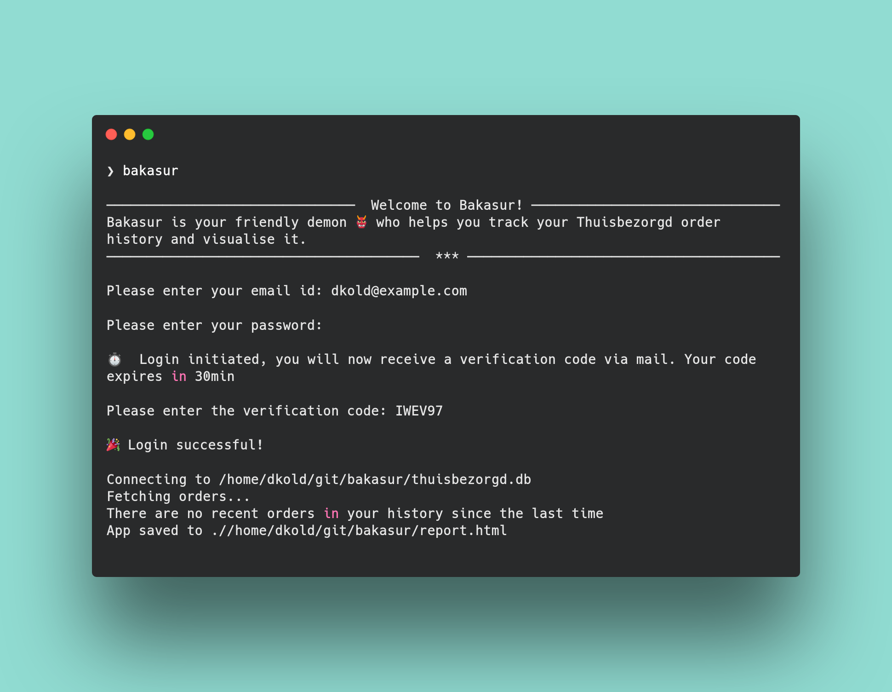

# Bakasur

***
[Bakasur](https://github.com/d-kold/bakasur) (_/buh-KAA-soor/_) is your friendly demon who helps you analyse your Thuisbezorgd order history and visualise it. 

### Disclaimer
***
This tool requires you to log in using your Thuisbezorgd credentials. Upon correct input, you will recieve 
a email with a verification code from Thuisbezorgd. Once the details are added, `bakasur` will create a `thuisbezorgd_token.json`
file in your current working directory which will store the `authToken` and `refreshToken` received from the login request. 
These tokens will help in authenticating the Thuisbezorgd API in the subsequent runs of this tool. 
If you are concerned about the security of the tokens they are on your local filesystem and you can also review
the code to check that there are no evil intentions here. **Your username and password are not stored.**

### How to use this tool
***
This tool uses a number of packages such as `typer`, `rich`, `datapane`. To avoid any conflicts with your current installed
site-packages, it is preferable to create a virtual environment and then install this tool.

- Create a virtual environment `virtualenv venv` and activate it `source venv/bin/activate`
- Install Bakasur using `pip install bakasur`
- Once it is installed you can now type in `bakasur` in your terminal and get started

### Tool specifics
***
When you first log in to Thuisbezorgd using `bakasur` it creates a sqlite database in your current working directory `thuisbezrgd.db`. 
The database stores all your orders and their details in tables `orders` and `items` respectively. During subsequent runs
of the tool, your most recent orders are inserted into the database 

Requires:
- Python v3.7.1+ 
- Thuisbezorgd account (duh!)

### Contribution
***
Give this tool a try and if you find any bugs or issues with it then feel free to open an issue or start a discussion.
Feature requests, Bug fixes are most welcome.

### License
***
[MIT License](https://github.com/d-kold/bakasur/blob/0d2317c116180b2e33d14e833c25352ff5a8e032/LICENSE.md)

### Important
***
This tool is intended for personal use. A fun hobby project for demo. I am not responsible if you tweak the code and violate 
any Thuisbezorgd Terms and Conditions. 

[d-kold](https://github.com/d-kold)